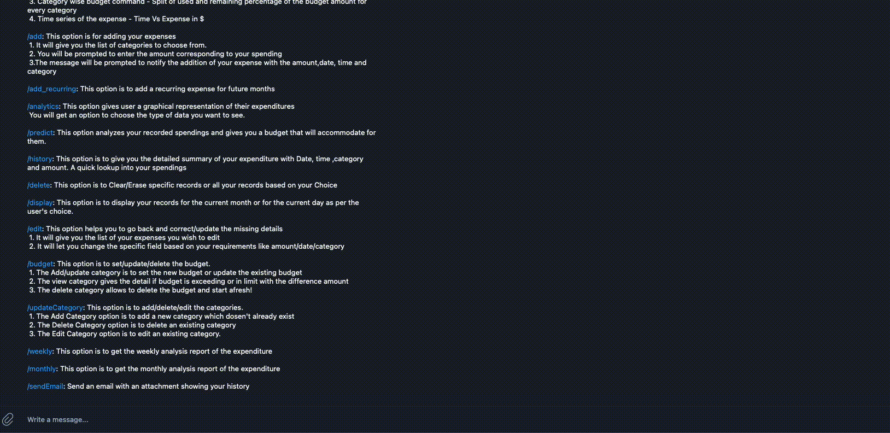
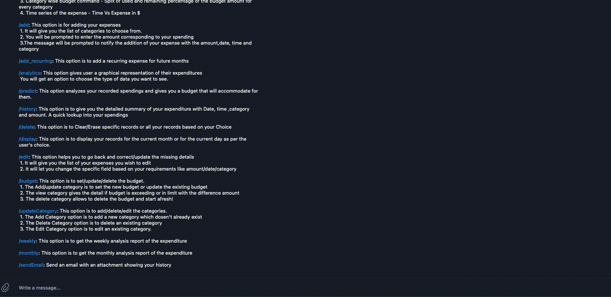
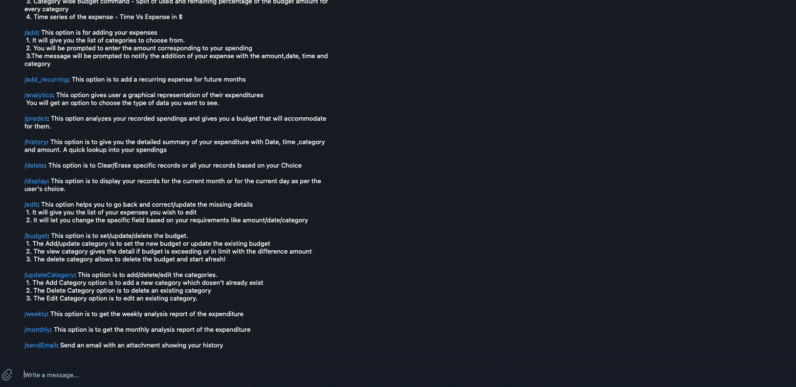
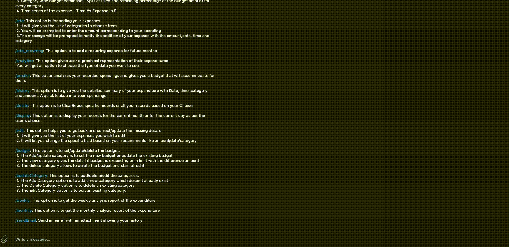

[](https://zenodo.org/doi/10.5281/zenodo.10146708)

[](https://desktop.telegram.org/)
[](https://codecov.io/gh/tpanati/DollarBot)


[](https://app.travis-ci.com/usmanwardag/dollar_bot)

# 💰 Dollar Bot 💰

<hr>

# DollarBot - Because your financial future deserves the best!

You wake up, brew a fresh cup of coffee, and start your day. You're excited because today is the day you take control of your finances like never before. How? Say hello to DollarBot, your ultimate financial companion. With simple commands, it transforms your financial story into one of motivation, empowerment, and control. 

And the best part? DollarBot is your financial sidekick, available exclusively on Telegram. That means no matter where you are, it's there to assist you in recording your expenses seamlessly.

<a href="https://www.canva.com/design/DAFxwU4ABIg/LqMkLeGUBhC__JmWmdkFiQ/watch?utm_content=DAFxwU4ABIg&utm_campaign=designshare&utm_medium=link&utm_source=editor">Click here for a video overview!!</a>

<hr>
<p align="center">
<a></a>
</p>
<hr>

## Scorecard

[Score card - Group 13](https://github.com/tpanati/DollarBot/blob/main/proj3/DollarBot_proj3_scorecard.csv)

## Demo Video

<a href="https://youtu.be/bAio20DZ_-I">https://youtu.be/bAio20DZ_-I</a>


## :money_with_wings: About DollarBot

DollarBot is a user-friendly Telegram bot designed to simplify your daily expense recording on a local system effortlessly.

With simple commands, this bot allows you to:

📝 **Add/Record a new spending:** As you sip that morning coffee, effortlessly log your expenses, no matter how small or significant. Every expense adds up, and DollarBot ensures you don't miss a thing.

💡 **Display your expenditure for the current day/month:** With DollarBot, you're never in the dark about your spending. Get real-time insights on your daily and monthly expenses, motivating you to stay on budget and crush your financial goals.

🔍 **Show your spending history:** Ever wondered where your money disappears to? DollarBot provides a detailed spending history that tells a story of your financial habits. It's a tale of lessons and opportunities for improvement.

🗑️ **Delete/Erase all your records:** Made an error or just want to start afresh? It's as simple as a command, a chance to correct your narrative without any hassle.

🔧 **Edit/Change any spending details:** Life is full of surprises, and sometimes expenses change. DollarBot adapts with you, offering easy editing options to keep your story accurate.

📊 Set Your Budget: Take full control of your finances by defining and tracking your budget with DollarBot. It's the proactive step that puts you firmly in the driver's seat of your financial journey.

📈 **Visualize your spending:** Numbers can be daunting, but DollarBot transforms them into a captivating visual experience. Use the '/chart' option to see your spending as graphs and pie charts. This punchline to your story helps you spot trends and make smarter financial choices.

📈 **Predict future expenses:** Predict your next month's budget based on your current expenditure

# :star: What's New?

- **Machine Learning Predictions:** Implemented machine learning techniques for predictive analytics, enhancing the accuracy and efficiency of expense predictions.
- **Email Notification Command:** Introduced a convenient send email command. When executed, this command automatically sends an email to the user containing detailed expenditure information.
- **CSV Export Command:** Implemented the csv command to export expenditure details to a CSV file. Users can execute this command to efficiently save and manage their financial data.
- **Weekly Expense Analysis:** Included a `weekly analysis` command to provide users with a comprehensive analysis of their expenses on a weekly basis.
- **Monthly Expense Analysis:** Introduced a `monthly analysis` command, enabling users to gain insights into their spending patterns over the course of a month.
- **Category Management:** Empowered users with the ability to manage expense categories. Users can add, edit, or delete categories according to their preferences.
- **Recurring Expenses:** Added the functionality for users to track recurring expenses. This feature facilitates the management of regularly occurring financial commitments.
- **Bug Fixes and Improved Flow:** Addressed numerous bugs and issues to enhance the overall stability and user experience of the application. The latest updates include fixes to issues related to the previous flow of the application, ensuring a smoother and more reliable user interaction. Our commitment to quality assurance and user satisfaction is reflected in these improvements.

Are you a developer? <a href="https://github.com/tpanati/DollarBot/blob/main/README.md">Click here: For Developers and Future Contributors</a>

# :rocket: Installation and Setup

## Pre-requisite: The Telegram Desktop App

Since DollarBot is built on top of Telegram, you'll first need:
1. Download the Telegram Desktop Application <a href="https://desktop.telegram.org/">here.</a>
```https://desktop.telegram.org/```
2. Create a Telegram account or Sign in.

Open up your terminal and let's get started:

### MacOS / Ubuntu Users

1. Clone this repository to your local system. 
```
   git clone https://github.com/aditikilledar/dollar_bot_SE23/
```
2. Start a terminal session in the directory where the project has been cloned. Run the following commands and follow the instructions on-screen to complete the installation.
```
  chmod a+x setup.sh
  bash setup.sh
```
There, all done!

The installation is easy for MacOS or on UNIX terminals. 

### Windows

With Windows, you'll need to use a platform to execute UNIX-like commands in order to execute the setup.sh bash script. Once in the platform, use the steps in the MacOS/Unix Section above to setup DollarBot.

We've used <a href="https://www.cygwin.com/">Cygwin,</a> but there are more options like WSL that you can explore.

Additionally, find more hints on Cygwin installation <a href="https://stackoverflow.com/questions/6413377/is-there-a-way-to-run-bash-scripts-on-windows">here.</a>

## Running DollarBot:

Once you've executed setup.sh, and all dependencies have been installed, you can start running DollarBot by following these instructions.

1. Open the Telegram Desktop Application and sign in. Once inside Telegram, search for "BotFather". Click on "Start", and enter the following command:
```
  /newbot
```
2. Follow the instructions on screen and choose a name for your bot (e.g., `dollarbot`). After this, select a UNIQUE username for your bot that ends with "bot", for example: `dollarbot_<your_nickname>`.

3. BotFather will now confirm the creation of your bot and provide a TOKEN to access the HTTP API - copy and save this token for future use. Make sure you save this token– don't lose it!

4. In the repo directory (where you cloned it), run these commands.

(a) grant execution access to a bash script
  ```
  chmod a+x run.sh
  ```

(b) execute the run.sh bash script to start DollarBot
   
#### MacOS / Unix
```
   bash run.sh
```
#### Windows
```
   ./run.sh
```

```Note```: It will ask you to paste the API token you received from Telegram while creating your bot (Step 3), so keep that handy.
A successful run will generate a message on your terminal that says "TeleBot: Started polling." 

5. In the Telegram app, search for your newly created bot by entering your UNIQUE username and open the bot you created.

6. Now, on Telegram, enter the "/start" or "menu" command, and you are all set to track your expenses!

### Run Automatically at Startup

To run the script automatically at startup / reboot, simply add the `.run_forever.sh` script to your `.bashrc` file, which executes whenever you reboot your system.
<a href="https://stackoverflow.com/questions/49083789/how-to-add-new-line-in-bashrc-file-in-ubuntu">Click here for help adding to .bashrc files.</a>

# :information_desk_person: Use Cases

Here's a quick overview of how each of the commands work. Simply enter /<command_name> into the Telegram chat and watch as the magic happens! 

### Menu
View all the commands Dollarbot offers to manage your expenses

<p align="center"></p>
It can be invoked by using `/menu` command.

### Help
Display the list of commands.

<p align="center"></p>
It can be invoked by using `/help` command.

### Pdf
Save history as PDF.

<p align="center"></p>
It can be invoked by using `/pdf` command.

### Add
This option is for adding your expenses.

<p align="center"></p>
1. It will give you the list of categories to choose from. <br> 
2. You will be prompted to enter the amount corresponding to your spending <br>      
3. The message will be prompted to notify the addition of your expense with the amount,date, time and category <br> 
4. It can be invoked by using `/add` command. 

### Analytics
This option gives user a graphical representation of their expenditures.

<p align="center"></p>
1. You will get an option to choose the type of data you want to see. <br> 
2. It can be invoked by using `/analytics` command.

### Predict
This option analyzes your recorded spendings and gives you a budget that will accommodate for them.

<p align="center"></p>
It can be invoked by using `/predict` command.

### History
This option is to give you the detailed summary of your expenditure with Date, time ,category and amount. A quick lookup into your spendings.

<p align="center"></p>
It can be invoked by using `/history` command.

### Delete
This option is to Clear/Erase all your records

<p align="center"></p>
It can be invoked by using `/delete` command.

### Edit
This option helps you to go back and correct/update the missing details    

<p align="center"></p>
1. It will give you the list of your expenses you wish to edit <br> 
2. It will let you change the specific field based on your requirements like amount/date/category <br> 
3. It can be invoked by using `/edit` command.

### Budget
This option is to set/update/delete the budget.     

<p align="center"></p>
1. The Add/update category is to set the new budget or update the existing budget <br>      
2. The view category gives the detail if budget is exceeding or in limit with the difference amount  <br>        
3. The delete category allows to delete the budget and start afresh! <br> 
4. It can be invoked by using `/budget` command.

### SendEmail
This option is to send you a email with you expenditures

<p align="center"></p>
It can be invoked by using `/sendEmail` command.

### Add Recurring
This option is to add a recurring expense for future months.

<p align="center"></p>
It can be invoked by using `/add_recurring` command.

### Update Category
This option is to add/delete/edit the categories.         

<p align="center"></p>
1. The Add Category option is to add a new category which dosen't already exist  <br>       
2. The Delete Category option is to delete an existing category  <br> 
3. The Edit Category option is to edit an existing category. <br> 
4. It can be invoked by using `/updateCategory` command.

### Weekly
This option is to get the weekly analysis report of the expenditure

<p align="center"></p>
It can be invoked by using `/weekly` command.

### Monthly
This option is to get the monthly analysis report of the expenditure

<p align="center"></p>
It can be invoked by using `/monthly` command.

# :construction: Road Map

Our implementation has been tracked in a project board which can be viewed here -
[DollarBot Developer board](https://github.com/users/tpanati/projects/2)

Some possible future enhancements are as follows:
1.	**AI-Driven Financial Insights:** Integrate advanced generative AI algorithms to provide personalized financial insights and recommendations. Leverage machine learning to analyze spending patterns and offer proactive suggestions for optimizing expenses.
2.	**Expense Sharing and Splitting:** Enable users to share expenses effortlessly with friends, family, or colleagues. Implement a feature that allows users to split bills and track shared expenses, making group financial management seamless.
3.	**Cross-Platform Compatibility:** Develop setup scripts specifically for Windows users to ensure a smooth and hassle-free installation process on this platform. Expand DollarBot's accessibility to a broader user base by optimizing its performance on Windows operating systems.
4.	**Natural Language Processing (NLP) Integration:** Enhance DollarBot's user experience by implementing Natural Language Processing (NLP) capabilities. Enable the bot to respond to casual conversation, making interactions more intuitive and user-friendly. Users can engage with DollarBot in a more conversational manner, improving overall usability.
5.  **Integration with Financial APIs:** Integrate with popular financial APIs to fetch real-time transaction data from bank accounts and credit cards. This enhancement provides users with up-to-the-minute financial information, ensuring accuracy and completeness in their spending records.
6.  **Multi-Currency Support:** Extend DollarBot's functionality to support multiple currencies, catering to users with diverse financial portfolios. This enhancement ensures accurate tracking and reporting for users dealing with expenses in different currencies.
7.  **Smart Notifications and Alerts:** Implement intelligent notification features to alert users about budget limits, unusual spending patterns, or upcoming bills. These proactive notifications will empower users to make informed financial decisions in real-time.
8.  **Secure Cloud Sync and Backup:** Implement a secure cloud sync and backup feature to ensure users' data is protected and accessible across devices. This enhancement provides users with peace of mind, knowing that their financial data is safely stored and can be easily recovered if needed.


:heart: Acknowledgements
---
We would like to thank Dr. Timothy Menzies for helping us understand the process of building a good Software Engineering project. We would also like to thank the teaching assistants San Gilson, Andre Lustosa, Xueqi (Sherry) Yang, Yasitha Rajapaksha, and Rahul Yedida for their support throughout the project.


:page_facing_up: License
---
This project is licensed under the terms of the MIT license. Please check [LICENSE](https://github.com/tpanati/DollarBot/blob/main/LICENSE) for more details.

## Contributors
<table>
  <tr>
    <td align="center"><br /><sub><b>Harshavardhan Bandaru</b></sub></a></td>
    <td align="center"><br /><sub><b>Vyshnavi Adusumeli</b></sub></a><br /></td>
    <td align="center"><br /><sub><b>Tejaswini Panati</b></sub></a><br /></td>
  </tr>
</table>

# :calling: Support

For any support, email us at `vadusum@ncsu.edu`
